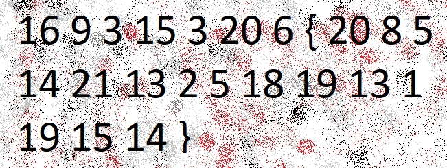

# The Numbers

## Description
The numbers... what do they mean?


## 解題
**16 9 2 15 3 20 6** 應該是對應 **picoCTF**，並且可以發現 p 是第 16 個字幕，可以推測數字代表第幾個英文字母。最後可得 flag :
```bash
picoCTF{thenumbersmason}
```

<!-- flag -->
所以本題 FLAG 
```text
picoCTF{thenumbersmason}
```
