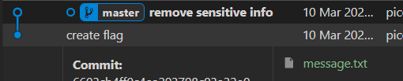
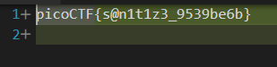

# Description
```text
I accidentally wrote the flag down. Good thing I deleted it!
You download the challenge files here:
challenge.zip
```

# 解題 (方法1：vscode)
可以使用任何可以檢視 git 工具，這裡使用 vscode。  
將檔案下載後，使用 vscode 開啟，檢視 git commit 紀錄，發現如下  

發現 `create flag` 的 commit 紀錄，所以直接打開，並檢視 message.txt 就可以看到 flag


# 解題 (方法2：git 指令)
使用 `git log` 發現有兩個提交紀錄
```bash
commit 3899edb7f3110d613c72ad40083fd8feeef703d0 (HEAD -> master)
Author: picoCTF <ops@picoctf.com>
Date:   Sat Mar 9 21:09:58 2024 +0000

    remove sensitive info

commit 6603cb4ff0c4ea293798c03a32e0d78d5ab12ca2
Author: picoCTF <ops@picoctf.com>
Date:   Sat Mar 9 21:09:58 2024 +0000

    create flag
```
使用 `git diff <commit hash1> <commit hash2>` 或 `git diff <commit hash1> <commit hash2> -- <file name>` 比較兩個 commit
```bash
┌──(kali㉿kali)-[~/Downloads/drop-in]
└─$ git diff 3899edb7f3110d613c72ad40083fd8feeef703d0 6603cb4ff0c4ea293798c03a32e0d78d5ab12ca2 -- message.txt
diff --git a/message.txt b/message.txt
index d552d1e..ed59373 100644
--- a/message.txt
+++ b/message.txt
@@ -1 +1 @@
-TOP SECRET
+picoCTF{s@n1t1z3_9539be6b}
```
<!-- flag -->
所以本題 FLAG 
```text
picoCTF{s@n1t1z3_9539be6b}
```
