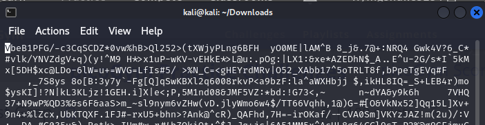
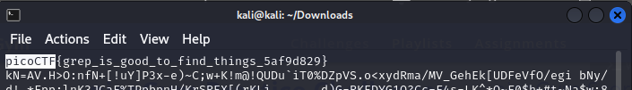

# Description
```text
Can you find the flag in file? This would be really tedious to look through manually, something tells me there is a better way.
```
# 解題 (方法 1)
先下載該 file  
然後直接使用文字編輯器打開  
(windows 可以使用記事本打開，以下使用 vim)  
```bash
vim file
```
看到如下  

接著使用搜尋 `picoCTF` 關鍵字  
(windows 如果使用記事本打開的話，可以使用 `ctrl + F` 找 picoCTF)  
發現 FLAG  


# 解題 (方法 2)
利用 `cat` 指令輸出檔案文字內容，再使用 `grep` 指令過濾文字  
故輸入以下指令  
```bash
cat file | grep "pico"
```
可以看到 flag  
發現 FLAG  

<!-- flag -->
所以本題 FLAG 
```text
picoCTF{grep_is_good_to_find_things_5af9d829}
```
