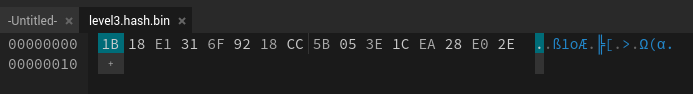
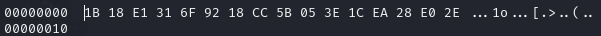

# Description
```text
Can you crack the password to get the flag?
Download the password checker here and you'll need the encrypted flag and the hash in the same directory too.
There are 7 potential passwords with 1 being correct. You can find these by examining the password checker script.
```


# 解題 (方法 1 : 直接看 python code)
可以看 level3.py 的最後一行 code , 直接把可能的密碼列出來，所以全部拿去試就可以得到 flag。  
```python
# The strings below are 7 possibilities for the correct password. 
#   (Only 1 is correct)
pos_pw_list = ["6997", "3ac8", "f0ac", "4b17", "ec27", "4e66", "865e"]
```

# 解題 (方法 2 : 檢視 byte 檔案後，破解 hash)
下在後的檔案有三個：
```bash
└─$ ls
level3.flag.txt.enc  level3.hash.bin  level3.py
```
解題步驟：
1. 檢視 `level3.hash.bin` byte 檔案
2. 破解 hash
3. 運行 `level3.py` 輸入密碼

### 檢視 level3.hash.bin
以下提供幾種方法檢視 byte 檔案

1. **使用線上網站**
可以使用檢視 byte 檔案的[網站](https://hexed.it/)查看 `level3.hash.bin` 內容，得到如下


2. **使用 `bvi`**
```bash
┌──(kali㉿kali)-[~/Downloads]
└─$ bvi level3.hash.bin 
```
得到以下內容


3. **使用 `xxd`**
```bash
└─$ xxd level3.hash.bin 
00000000: 1b18 e131 6f92 18cc 5b05 3e1c ea28 e02e  ...1o...[.>..(..
```

4. **使用 `hexdump`**
```bash
└─$ hexdump level3.hash.bin 
0000000 181b 31e1 926f cc18 055b 1c3e 28ea 2ee0
0000010
```

### 破解 hash
上個步驟取得 level3.hash.bin 的內容 ( 以 16 進位表示 ) ，接下來要破解 hash。以下提供一些破解 hash 的方法：

1. **使用 hash 破解網站**
推薦使用 [crack station](https://crackstation.net/) ，它會自動偵測 hash 類型並破解，破解後即可得到密碼 `865e`


2. **使用 `John the Ripper`**
可以先看 `level3.py`的 `hash_pw` function，可以知道 hash 和 md5 有關
```python
def hash_pw(pw_str):
    pw_bytes = bytearray()
    pw_bytes.extend(pw_str.encode())
    m = hashlib.md5()
    m.update(pw_bytes)
    return m.digest()
```
先把剛剛檢視的 byte 檔案內容 ( 16 進位表示 ) 存放在一個檔案裏面
```bash
└─$ echo "1b18e1316f9218cc5b053e1cea28e02e" > hash.txt
```
接下來使用 `John the Ripper` 指定 format 為 raw-md5，並使用 `--show` 顯示結果，即可得到破解出的密碼是 `865e`：
```bash
└─$ john --show --format=raw-md5 hash.txt             
?:865e

1 password hash cracked, 0 left
```


### 運行 `level3.py`
最後在執行 `level3.py` 並輸入 `865e` 即可得到 flag
```bash
┌──(kali㉿kali)-[~/Downloads]
└─$ python level3.py
Please enter correct password for flag: 865e
Welcome back... your flag, user:
picoCTF{m45h_fl1ng1ng_2b072a90}
```

<!-- flag -->
所以本題 FLAG 
```text
picoCTF{m45h_fl1ng1ng_2b072a90}
```


# 相關指令
[John The Ripper](../Info/John%20the%20Ripper.md)
[bvi](../Info/bvi.md)
[xxd](../Info/xxd.md)
[hexdump](../Info/hexdump.md)

# 相關網站
[HexEdit](https://hexed.it/)
[CrackStation](https://crackstation.net/)
