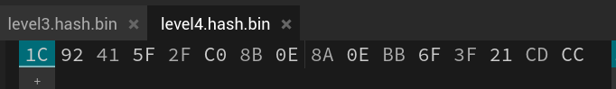

# Description
Can you crack the password to get the flag?
Download the password checker here and you'll need the encrypted flag and the hash in the same directory too.
There are 100 potential passwords with only 1 being correct. You can find these by examining the password checker script.


# 解題(方法1：直接修改 `level4.py` )
可以看到 `level4.py` 最後面有提供所有可能的密碼，故修改一下 code ，寫個 `for` 迴圈讓它自動嘗試所有可能的密碼，就可以輸出 flag 了。
```python
import hashlib

### THIS FUNCTION WILL NOT HELP YOU FIND THE FLAG --LT ########################
def str_xor(secret, key):
    #extend key to secret length
    new_key = key
    i = 0
    while len(new_key) < len(secret):
        new_key = new_key + key[i]
        i = (i + 1) % len(key)        
    return "".join([chr(ord(secret_c) ^ ord(new_key_c)) for (secret_c,new_key_c) in zip(secret,new_key)])
###############################################################################

flag_enc = open('level4.flag.txt.enc', 'rb').read()
correct_pw_hash = open('level4.hash.bin', 'rb').read()


def hash_pw(pw_str):
    pw_bytes = bytearray()
    pw_bytes.extend(pw_str.encode())
    m = hashlib.md5()
    m.update(pw_bytes)
    return m.digest()


def level_4_pw_check():
    for user_pw in pos_pw_list:
      user_pw_hash = hash_pw(user_pw)
      
      if( user_pw_hash == correct_pw_hash ):
          print("Welcome back... your flag, user:")
          decryption = str_xor(flag_enc.decode(), user_pw)
          print(decryption)
          return
      print("That password is incorrect")


# The strings below are 100 possibilities for the correct password. 
#   (Only 1 is correct)
pos_pw_list = ["6288", "6152", "4c7a", "b722", "9a6e", "6717", "4389", "1a28", "37ac", "de4f", "eb28", "351b", "3d58", "948b", "231b", "973a", "a087", "384a", "6d3c", "9065", "725c", "fd60", "4d4f", "6a60", "7213", "93e6", "8c54", "537d", "a1da", "c718", "9de8", "ebe3", "f1c5", "a0bf", "ccab", "4938", "8f97", "3327", "8029", "41f2", "a04f", "c7f9", "b453", "90a5", "25dc", "26b0", "cb42", "de89", "2451", "1dd3", "7f2c", "8919", "f3a9", "b88f", "eaa8", "776a", "6236", "98f5", "492b", "507d", "18e8", "cfb5", "76fd", "6017", "30de", "bbae", "354e", "4013", "3153", "e9cc", "cba9", "25ea", "c06c", "a166", "faf1", "2264", "2179", "cf30", "4b47", "3446", "b213", "88a3", "6253", "db88", "c38c", "a48c", "3e4f", "7208", "9dcb", "fc77", "e2cf", "8552", "f6f8", "7079", "42ef", "391e", "8a6d", "2154", "d964", "49ec"]
level_4_pw_check()
```
執行腳本後輸出
```bash
┌──(kali㉿kali)-[~/Downloads]
└─$ python level4.py
That password is incorrect
That password is incorrect
That password is incorrect
That password is incorrect
That password is incorrect
That password is incorrect
That password is incorrect
That password is incorrect
That password is incorrect
That password is incorrect
That password is incorrect
That password is incorrect
That password is incorrect
That password is incorrect
That password is incorrect
Welcome back... your flag, user:
picoCTF{fl45h_5pr1ng1ng_ae0fb77c}
```

# 解題(方法2：檢視 bin，破解 hash)
### 步驟一：檢視 bin
使用可以檢視 byte 檔案的 [網站](https://hexed.it/) 或是使用 [xxd](../Info/xxd.md)、[hexdump](../Info/hexdump.md)、[bvi](../Info/bvi.md)查看 `level4.hash.bin` 內容

將 hash 儲存到 hash.txt
```bash
echo "1C92415F2FC08B0E8A0EBB6F3F21CDCC" > hash.txt
```

### 步驟二：破解 hash
從 `level4.py` `line 21` 可以發現是使用 md5。可以使用 [hash 破解網站](https://crackstation.net/) 或是使用 [John The Ripper](../Info/John%20the%20Ripper.md) 破解，就可以拿到密碼 `973a`。
```bash
└─$ john --format=raw-md5 hash.txt 
Using default input encoding: UTF-8
Loaded 1 password hash (Raw-MD5 [MD5 256/256 AVX2 8x3])
Warning: no OpenMP support for this hash type, consider --fork=2
Proceeding with single, rules:Single
Press 'q' or Ctrl-C to abort, almost any other key for status
Almost done: Processing the remaining buffered candidate passwords, if any.
Proceeding with wordlist:/usr/share/john/password.lst
Proceeding with incremental:ASCII
973a             (?)     
1g 0:00:00:04 DONE 3/3 (2024-08-01 06:07) 0.2336g/s 19709Kp/s 19709Kc/s 19709KC/s 977k..97ez
Use the "--show --format=Raw-MD5" options to display all of the cracked passwords reliably
Session completed.
```

### 步驟三：執行 `level4.py`
執行 `level4.py` 並輸入密碼 `973a` 就可以得到 flag
```bash
┌──(kali㉿kali)-[~/Downloads]
└─$ python level4.py
Please enter correct password for flag: 973a
Welcome back... your flag, user:
picoCTF{fl45h_5pr1ng1ng_ae0fb77c}
```
<!-- flag -->
所以本題 FLAG 
```text
picoCTF{fl45h_5pr1ng1ng_ae0fb77c}
```

# 相關學習資源
### bin 檔案檢視
- **工具**
  - [xxd](../Info/xxd.md)  
  - [hexdump](../Info/hexdump.md)  
  - [bvi](../Info/bvi.md)  

- **網站**
  - [HexEdit](https://hexed.it/)  
### md5 hash 破解
- **工具**
  - [John The Ripper](../Info/John%20the%20Ripper.md)  

- **網站**
  - [Crack Station](https://crackstation.net/)  