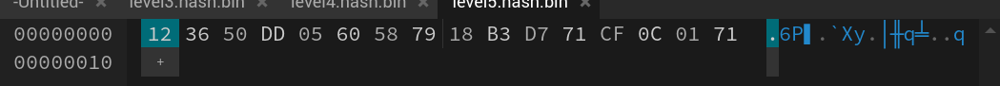
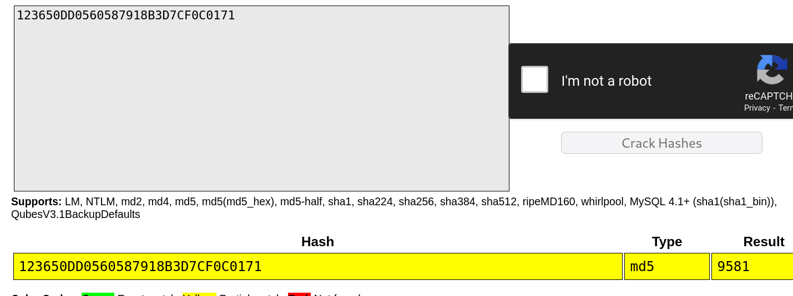

# Description
Can you crack the password to get the flag? Download the password checker here and you'll need the encrypted flag and the hash in the same directory too. Here's a dictionary with all possible passwords based on the password conventions we've seen so far.


# 解題（方法1：使用線上網站工具）
從 `level5.py` `line 21` 可以發現是使用 md5，接下來使用可以檢視 byte 檔案的 [網站](https://hexed.it/) 查看 `level5.hash.bin` 內容

將這段內容
將這段內容丟到 [hash 破解網站](https://crackstation.net/) 即可得到密碼 `9581`

執行 `level5.py` 並輸入密碼 `9581` 就可以得到 flag
```bash
┌──(kali㉿kali)-[~/Downloads]
└─$ python level5.py 
Please enter correct password for flag: 9581
Welcome back... your flag, user:
picoCTF{h45h_sl1ng1ng_36e992a6}
```

# 解題（方法2：使用工具）
### 步驟一：檢視二進位 bin 檔案
可以使用 [xxd](../Info/xxd.md)、[hexdump](../Info/hexdump.md)、[bvi](../Info/bvi.md)，擇一即可，以下示範使用 `hexdump`
```bash
# 使用 hexdump
┌──(kali㉿kali)-[~/Downloads]
└─$ hexdump level5.hash.bin 
0000000 3612 dd50 6005 7958 b318 71d7 0ccf 7101
0000010

# 將 hash 存到 hash.txt
┌──(kali㉿kali)-[~/Downloads]
└─$ echo "123650dd0560587918b3d771cf0c0171" > hash.txt
```

### 步驟二：破解 md5 hash
從 `level5.py` `line 21` 可以發現是使用 md5，以下使用 [John The Ripper](../Info/John%20the%20Ripper.md) 搭配字典進行破解，得到密碼 9581
```bash
└─$ john  --wordlist=/usr/share/wordlists/rockyou.txt --format=raw-md5 hash.txt 
Using default input encoding: UTF-8
Loaded 1 password hash (Raw-MD5 [MD5 256/256 AVX2 8x3])
Warning: no OpenMP support for this hash type, consider --fork=2
Press 'q' or Ctrl-C to abort, almost any other key for status
9581             (?)     
1g 0:00:00:00 DONE (2024-08-01 00:12) 2.702g/s 31303Kp/s 31303Kc/s 31303KC/s 9582162..95782404
Use the "--show --format=Raw-MD5" options to display all of the cracked passwords reliably
Session completed.
```
PS : 如果你的 `rockyou.txt` 尚未解壓縮（也就是`/usr/share/wordlists/rockyou.txt.gz`）請先解壓縮：
```bash
sudo gunzip /usr/share/wordlists/rockyou.txt.gz
```
### 步驟三：執行 `level5.py`
最後執行 `level5.py` 並輸入密碼 `9581` 即可得到 flag
```bash
┌──(kali㉿kali)-[~/Downloads]
└─$ python level5.py                                
Please enter correct password for flag: 9581
Welcome back... your flag, user:
picoCTF{h45h_sl1ng1ng_36e992a6}
```


<!-- flag -->
所以本題 FLAG 
```text
picoCTF{h45h_sl1ng1ng_36e992a6}
```

# 相關學習資源
### bin 檔案檢視
- **工具**
  - [xxd](../Info/xxd.md)  
  - [hexdump](../Info/hexdump.md)  
  - [bvi](../Info/bvi.md)  

- **網站**
  - [HexEdit](https://hexed.it/)  
### md5 hash 破解
- **工具**
  - [John The Ripper](../Info/John%20the%20Ripper.md)  

- **網站**
  - [Crack Station](https://crackstation.net/)  