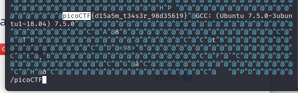

# Description
```text
Can you look at the data in this binary: static? This BASH script might help!
```
# 解題
下載檔案後，直接使用 `vim` 打開並搜尋 `picoCTF` 關鍵字即可找到 flag
```bash
vim static
```

<!-- flag -->
所以本題 FLAG 
```text
picoCTF{d15a5m_t34s3r_98d35619}
```
