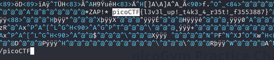

# Description
Using tabcomplete in the Terminal will add years to your life, esp. when dealing with long rambling directory structures and filenames: Addadshashanammu.zip
# 解題
這題只是要讓人練習在 terminal 時，使用 `tab` 鍵，自動提示或完成檔名。
下載檔案完後，使用 `unzip` 解壓縮，強烈建議使用 tab 輔助輸入
```bash
unzip Addadshashanammu.zip
```
解壓縮完後，利用 `cd` 進入資料夾，接下來就是一連串資料夾，一直按 tab，按到不能按後(進到最底層資料夾)，發現裡面有個檔案 `fang-of-haynekhtnamet`，使用 `vim` 開這個檔案後，搜尋 `picoCTF` 關鍵字就可以找到 flag


<!-- flag -->
所以本題 FLAG 
```text
picoCTF{l3v3l_up!_t4k3_4_r35t!_f3553887}
```