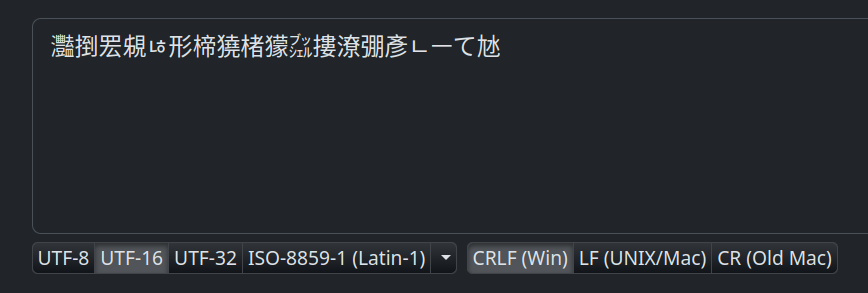
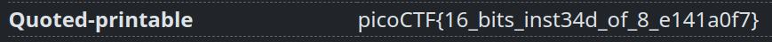

# Description
```text
I wonder what this really is... enc ''.join([chr((ord(flag[i]) << 8) + ord(flag[i + 1])) for i in range(0, len(flag), 2)])
```


# 解題
打開 `enc` 出現亂碼
```text
灩捯䍔䙻ㄶ形楴獟楮獴㌴摟潦弸彥ㄴㅡて㝽
```
所以推測試編碼不同導致，然後一般我們使用的是 `utf-8` ，所以這個文本的編碼應該是非 `utf-8`，接下來可以去一些[編碼轉換網站](https://dencode.com/string "編碼轉換網站")嘗試如下


將編碼轉成 `utf-16` 後，可以在下面的 `Quoted-printable` 看到 flag



<!-- flag -->
所以本題 FLAG 
```text
picoCTF{16_bits_inst34d_of_8_e141a0f7}
```
