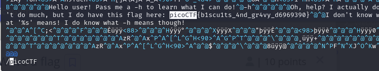

# Description
Can you invoke help flags for a tool or binary? This program has extraordinarily helpful information...

# 解題
下載檔案後，直接使用 vim 打開，並搜尋 `picoCTF` 關鍵字，即可看到 flag
```bash
vim warm
```
利用 `/要尋找的字` 在 vim 搜尋關鍵字(相當於 ctrl + F)
```bash
/picoCTF
```

<!-- flag -->
所以本題 FLAG 
```text
picoCTF{b1scu1ts_4nd_gr4vy_d6969390}
```
