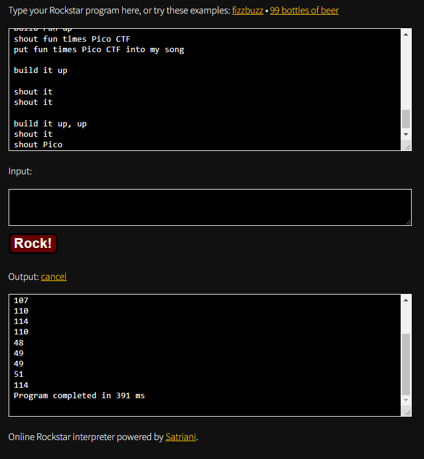

# Description
I wrote you a song. Put it in the picoCTF{} flag format.

# 解題
將 song 下載後，看起來像歌詞，如下：
```text
Pico's a CTFFFFFFF
my mind is waitin
It's waitin

Put my mind of Pico into This
my flag is not found
put This into my flag
put my flag into Pico
```
之後看到這題的 Hint，內容如下：
```text
Do you think you can master rockstar?
```
上網搜尋 master rockstar，發現原來 rockstar 是一種程式語言，可以查看 [rockstart 官方網站的 Try It](https://codewithrockstar.com/online "rockstart 官方網站的 Try It")，並將歌詞貼上，按下 Rock，可以得到一串數字，如下：

寫一隻 python 將那些數字轉 ASCII 字元：
```python
words = '''114
114
114
111
99
107
110
114
110
48
49
49
51
114'''.split()

for word in words:
  print(chr(eval(word)), end='')
print()
```
輸出
```bash
rrrocknrn0113r
```

<!-- flag -->
所以本題 FLAG 
```text
picoCTF{rrrocknrn0113r}
```