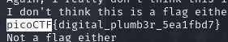

# Description
```text
Sometimes you need to handle process data outside of a file. Can you find a way to keep the output from this program and search for the flag? Connect to jupiter.challenges.picoctf.org 4427.
```
# 解題(方法 1)
先使用 `netcat` 連接看看  
```bash
nc jupiter.challenges.picoctf.org 4427
```
得到以下回傳  
```bash
I don't think this is a flag either
Not a flag either
Not a flag either
This is defintely not a flag
Not a flag either
Again, I really don't think this is a flag
I don't think this is a flag either
Not a flag either
Not a flag either
Not a flag either
...
```
發現資訊太雜了，故更改指令，將收到的回傳先存到一個檔案裡  
```bash
nc jupiter.challenges.picoctf.org 4427 > data
```
接著使用文字編輯器檢視該檔案(以下使用 vim)
```bash
vim data
```
並搜尋 `picoCTF` 關鍵字，發現FLAG  


# 解題(方法 2)
直接使用 `grep` 過濾接收的回傳資料  
```bash
nc jupiter.challenges.picoctf.org 4427 | grep "picoCTF"
```
即可直接得到 FLAG  


<!-- flag -->
所以本題 FLAG 
```text
picoCTF{digital_plumb3r_5ea1fbd7}
```
