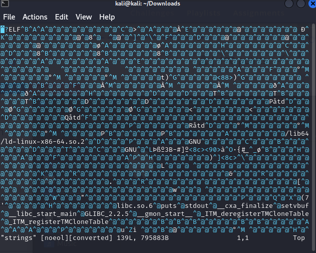
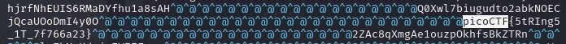

# Description
```text
Can you find the flag in file without running it?
```
# 解題
先下載該 file  
然後直接使用文字編輯器打開  
(windows 可以使用記事本打開，以下使用 vim)  
```bash
vim strings
```
看到如下  

接著使用搜尋 `picoCTF` 關鍵字  
(windows 如果使用記事本打開的話，可以使用 `ctrl + F` 找 picoCTF)  
發現 FLAG  


<!-- flag -->
所以本題 FLAG 
```text
picoCTF{5tRIng5_1T_7f766a23}
```
