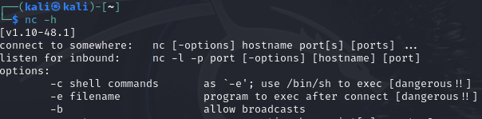
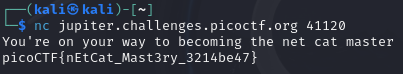

# Description
```text
Using netcat (nc) is going to be pretty important. Can you connect to jupiter.challenges.picoctf.org at port 41120 to get the flag?
```
# netcat
是一個網路工具，可以建立 connect 或是傳輸檔案等。kali linux 內建就有這個工具。  
使用方式可以輸入 `nc -h` 指令查看  

## 建立連接
### 語法  
```bash
nc [options] [hostname] [port]
```
# 解題
本題要求使用 netcat 連接到 hostname `jupiter.challenges.picoctf.org` port `41120`  
故打開 kali linux terminal，輸入以下指令
```bash
nc jupiter.challenges.picoctf.org 41120
```
收到回傳的FLAG  

<!-- flag -->
所以本題 FLAG 
```text
picoCTF{nEtCat_Mast3ry_3214be47}
```

# 相關指令
[netcat](../Info/netcat.md)  